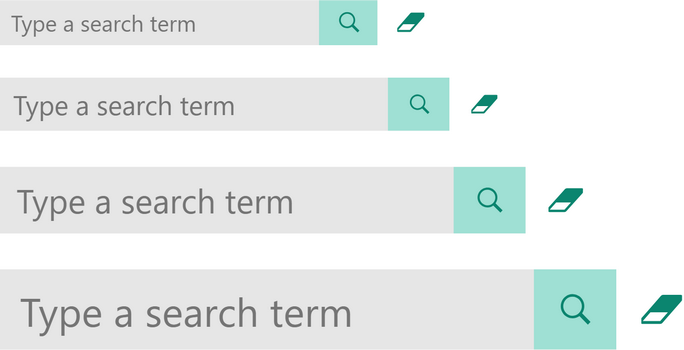

# flexTextFilter

A customisable text filter visual for Power BI, heavily inspired by Microsoft's Text Filter visual and using the 2.6 API version.

### Features
- Scales cleanly by font size.
- Customisable background, border, text and button colours.
- Support for custom placeholder text (including selected field name) and suggestions.
- Optional live search filters data automatically when user stops typing.

### Installation
- Download 'flexTextFilter.#.#.#.pbiviz' from the
   /dist folder.
- In Power BI, select 'Import from file' in visualizations tool pane and select the downloaded file.
